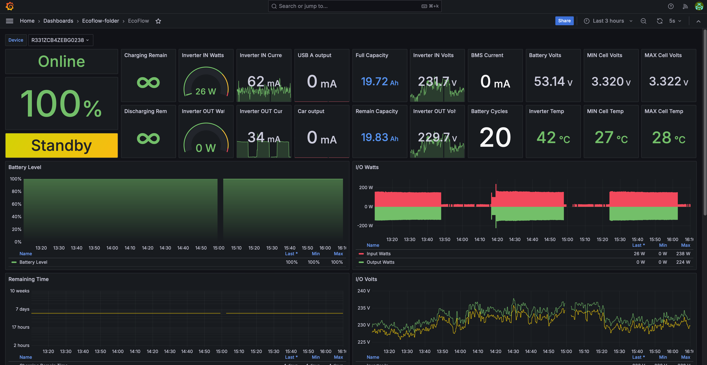

# EcoFlow to Prometheus exporter in Go via Rest API

## About the project

This is an Ecoflow metrics exporter to Prometheus implemented in Go.\
It uses library https://github.com/tess1o/go-ecoflow to fetch the metrics from your Ecoflow devices via Ecoflow Rest
API. More details about the API are on their website: https://developer-eu.ecoflow.com/

Other known to me projects use MQTT protocol to scrap the metrics, this implementation uses Rest API.

## Grafana dashboard:
It's slightly update version of Grafana Dashboard with ID = `17812`. I've added USB output and Car Plug output metrics.


## How to get Access Token and Secret Token

1. Go to https://developer-eu.ecoflow.com/
2. Click on "Become a Developer"
3. Login with your Ecoflow username and Password
4. Wait until the access is approved by Ecoflow
5. Receive email with subject "Approval notice from EcoFlow Developer Platform". May take some time
6. Go to https://developer-eu.ecoflow.com/us/security and create new AccessKey and SecretKey

## How to run the Exporter, Prometheus and Grafana using docker-compose

1. Go to docker-compose folder: `cd docker-compose`
2. Update `.env` file with two mandatory parameters:
    - `ECOFLOW_ACCESS_KEY`
    - `ECOFLOW_SECRET_KEY`
3. (OPTIONALLY) Update other variables if you need to:
    - `METRIC_PREFIX`: the prefix that will be added to all metrics. Default value is `ecoflow`. For instance
      metric `bms_bmsStatus.minCellTemp` will be exported to prometheus as `ecoflow.bms_bmsStatus.minCellTemp`. With
      default value `ecoflow` you can use Grafana Dashboard with ID `17812` without any changes.
    - `PROMETHEUS_INTERVAL` - scrapping interval in seconds. How often should the exporter execute requests to Ecoflow
      Rest API in order to get the data. Default value is 30 seconds. Align this value
      with `docker-compose/prometheus/prometheus.yml`
    - `DEBUG_ENABLED` - enable debug log messages. Default value is "false". To enable use values `true` or `1`
    - `GRAFANA_USERNAME` - admin username in Grafana. Can be changed later in Grafana UI
    - `GRAFANA_PASSWORD` - admin password in Grafana. Can be changed later in Grafana UI
4. Save `.env` file with your changes.
5. Start all containers: `docker-compose -f compose.yaml up -d`
     ```
   CONTAINER ID   IMAGE                                COMMAND                  CREATED          STATUS         PORTS                                         NAMES
   93c9cf317861   docker-compose-go_ecoflow_exporter   "/app/ecoflow-export…"   6 seconds ago    Up 5 seconds   0.0.0.0:2112->2112/tcp, :::2112->2112/tcp     go_ecoflow_exporter
   fea150b4ef5d   grafana/grafana                      "/run.sh"                16 minutes ago   Up 5 seconds   0.0.0.0:3000->3000/tcp, :::3000->3000/tcp     grafana
   823c6adfad90   prom/prometheus                      "/bin/prometheus --c…"   16 minutes ago   Up 5 seconds   0.0.0.0:9090->9090/tcp, :::9090->9090/tcp     prometheus
   ```
6. The services are available here:
    - http://localhost:2112/metrics - the exporter
    - http://localhost:9090 - Prometheus
    - http://localhost:3000 - Grafana

7. Navigate to http://localhost:3000 in your web browser and use GRAFANA_USERNAME / GRAFANA_PASSWORD credentials from
   .env file to access Grafana. It is already configured with prometheus as the default datasource.
   Navigate to Dashboards → Import dashboard → import ID `17812`, select the only existing Prometheus datasource.
   (The Grafana dashboard was implemented
   in https://github.com/berezhinskiy/ecoflow_exporter/tree/master/docker-compose)

### Build from source code

In order to build image locally and run the services use the instruction above. Step#5 should be replaced with the
commands:

```
docker-compose -f compose-local-build.yaml build --no-cache
docker-compose -f compose-local-build.yaml up -d
```

It will build the exporter from local source code and start the exporter, prometheus and grafana

## Compare to other exporters

This implementation is inspired by https://github.com/berezhinskiy/ecoflow_exporter, and it's fully
compatible with their grafana dashboard. This exporter by default uses the same prefix for the metrics (`ecoflow`)
Both exporters support all parameters returned by the API. MQTT and Rest API actually return the same set of parameters.
This implementation was tested on Delta 2 and River 2.

Some difference between this project and https://github.com/berezhinskiy/ecoflow_exporter:

1. This project requires `ACCESS_KEY` and `SECRET_KEY` that can be obtained on https://developer-eu.ecoflow.com/. For
   me, it took less than 1 day until Ecoflow approved access to the API. The other project needs only ecoflow
   credentials (login and password)
2. This project doesn't hardcode devices `Serial Numbers` and this exporter can export metrics from all linked devices.
   Internally it uses Ecoflow API to fetch the list of linked devices and then for each device it exports the
   metrics. https://github.com/berezhinskiy/ecoflow_exporter can export metrics for a single device only, and you have
   to hardcode it's Serial Number in the env variables. If you have 5 devices, then you need to run 5 instances of the
   exporter
3. The image size (not compressed!) of this exporter is only 21MB, `ghcr.io/berezhinskiy/ecoflow_exporter` is 142 MB
4. This implementation is extremely lightweight and barely consumes any RAM & CPU (it needs less than 10MB of RAM to
   scrap metrics from 2 devices)