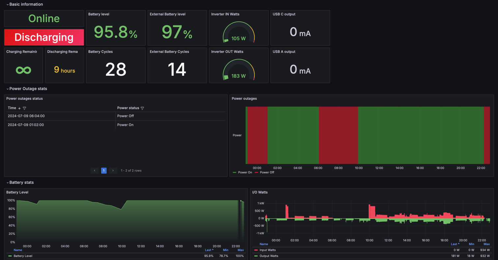

## How to run everything - basic usage

1. Go to docker-compose folder: `cd docker-compose`
2. Update `.env` file with:
    - `PROMETHEUS_ENABLED` - true
    - `EXPORTER_TYPE` - mqtt
    - `ECOFLOW_EMAIL` - your email address that you use to log in to the Ecoflow mobile app
    - `ECOFLOW_PASSWORD` - your ecoflow password
    - `ECOFLOW_DEVICES` - the list of devices serial numbers separated by comma. For instance: `SN1,SN2,SN3`
    - `ECOFLOW_DEVICES_PRETTY_NAMES` - the key/value map of custom names for your devices. Key is a serial number, value
      is a device name you want to see in Grafana Dashboard. It's helpful to see a meaningful name in Grafana dashboard
      instead of a serial number.It's optional but either `ECOFLOW_DEVICES` or `ECOFLOW_DEVICES_PRETTY_NAMES` should be
      populated. Example: `ECOFLOW_DEVICES_PRETTY_NAMES={"R33XXXXXXXXX":"My Delta 2", "R33YYYYY":"Delta Pro backup"}`.

3. (OPTIONALLY) Update other variables if you need to:
    - `GRAFANA_USERNAME` - admin username in Grafana. Default value: `grafana`. Can be changed later in Grafana UI
    - `GRAFANA_PASSWORD` - admin password in Grafana. Default value: `grafana`. Can be changed later in Grafana UI
4. Save `.env` file with your changes.
5. Your `.env` file should look like this:

```properties
EXPORTER_TYPE=mqtt
PROMETHEUS_ENABLED=true
ECOFLOW_DEVICES=Serial_Number_1,Serial_Number_2,Serial_Number_3
ECOFLOW_EMAIL=my_ecoflow_email@gmail.com
ECOFLOW_PASSWORD=ecoflow_password
GRAFANA_USERNAME=admin
GRAFANA_PASSWORD=admin
```

or

```properties
EXPORTER_TYPE=mqtt
PROMETHEUS_ENABLED=true
ECOFLOW_DEVICES_PRETTY_NAMES={"R33XXXXXXXXX":"My Delta 2", "R33YYYYY":"Delta Pro backup"}
ECOFLOW_EMAIL=my_ecoflow_email@gmail.com
ECOFLOW_PASSWORD=ecoflow_password
GRAFANA_USERNAME=admin
GRAFANA_PASSWORD=admin
```

6. Start all
   containers: `docker-compose -f docker-compose/grafana-compose.yml -f docker-compose/exporter-remote-compose.yml -f docker-compose/prometheus-compose.yml up -d`
     ```
   CONTAINER ID   IMAGE                                COMMAND                  CREATED          STATUS         PORTS                                         NAMES
   93c9cf317861   docker-compose-go_ecoflow_exporter   "/app/ecoflow-export…"   6 seconds ago    Up 5 seconds   0.0.0.0:2112->2112/tcp, :::2112->2112/tcp     go_ecoflow_exporter
   fea150b4ef5d   grafana/grafana                      "/run.sh"                16 minutes ago   Up 5 seconds   0.0.0.0:3000->3000/tcp, :::3000->3000/tcp     grafana
   823c6adfad90   prom/prometheus                      "/bin/prometheus --c…"   16 minutes ago   Up 5 seconds   0.0.0.0:9090->9090/tcp, :::9090->9090/tcp     prometheus
   ```
7. The services are available here:
    - http://localhost:2112/metrics - the exporter
    - http://localhost:9090 - Prometheus
    - http://localhost:3000 - Grafana

8. Navigate to http://localhost:3000 in your web browser and use GRAFANA_USERNAME / GRAFANA_PASSWORD credentials from
   .env file to access Grafana. It is already configured with prometheus as the default datasource.
   Navigate to Dashboards → Import dashboard → import ID `17812`, select the only existing Prometheus datasource.
   (The Grafana dashboard was implemented
   in https://github.com/berezhinskiy/ecoflow_exporter/tree/master/docker-compose)

## Dashboard example

