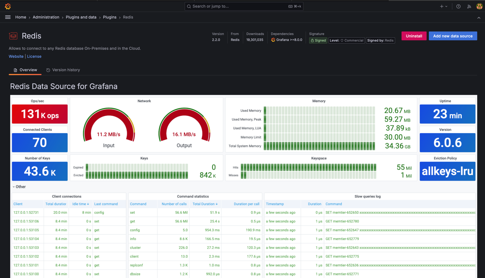
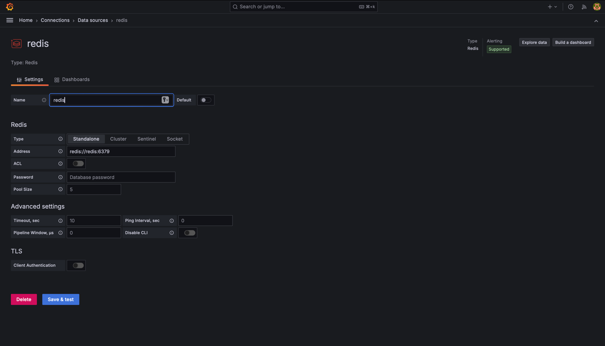
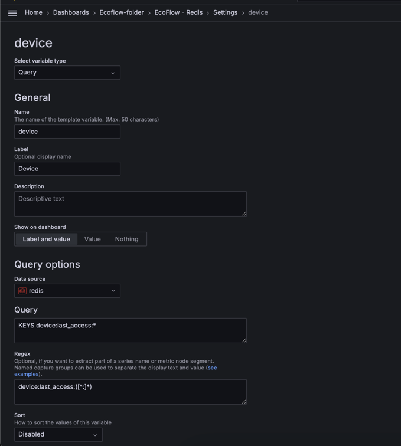
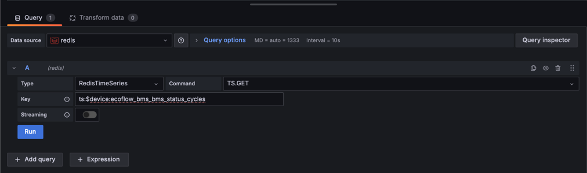

## Data structure

All metrics are stored as TimeSeries with key structure:
`ts:%device_serial_number%:%metric_name%`

For instance:

```
ts:R123YHY5ABCE1346:ecoflow_bms_bms_status_cycles
ts:R123YHY5ABCE1346:ecoflow_bms_bms_status_soc
```

Additionally, there is a key/value to store device SN and last access date:
`device:last_access:%device_serial_number%`
This can be useful when declaring variables in Grafana to fetch all devices you have

## How to run the Redis, Exporter and Grafana using docker-compose

1. Go to docker-compose folder: `cd docker-compose`
2. Update `.env` file with two mandatory parameters:
    - `REDIS_ENABLED` - true (or 1) if you want to enable integration with Redis. Default value is false
    - `EXPORTER_TYPE` - the type of exporter you'd like to use. Possible values: `rest` and `mqtt`. Default value
      is `rest`.

   If  `EXPORTER_TYPE=rest` is selected, then provide values for the following parameters:
    - `ECOFLOW_ACCESS_KEY` - the access key from the Ecoflow development website
    - `ECOFLOW_SECRET_KEY` - the secret key from the Ecoflow development website

   If  `EXPORTER_TYPE=mqtt` is selected, then provide values for the following parameters:
    - `ECOFLOW_EMAIL` - your email address that you use to log in to the Ecoflow mobile app
    - `ECOFLOW_PASSWORD` - your ecoflow password
    - `ECOFLOW_DEVICES` - the list of devices serial numbers separated by comma. For instance: `SN1,SN2,SN3`

3. (OPTIONALLY) Update other variables if you need to:
    - `REDIS_URL` - Redis url. Default value: `localhost:6379`
    - `REDIS_DB` - Redis database. Default value: `0`
    - `REDIS_USER` - Redis username. Default value: no value
    - `REDIS_PASSWORD` - Redis password. Default value: no value
    - `METRIC_PREFIX`: the prefix that will be added to all metrics. Default value is `ecoflow`. For instance
      metric `bms_bmsStatus.minCellTemp` will be exported to prometheus as `ecoflow.bms_bmsStatus.minCellTemp`.
    - `SCRAPING_INTERVAL` - scrapping interval in seconds. How often should the exporter execute requests to Ecoflow
      Rest API in order to get the data. Default value is 30 seconds.
    - `MQTT_DEVICE_OFFLINE_THRESHOLD_SECONDS` - the threshold in seconds which indicates how long we should way for a
      metric message from MQTT broker. Default value: 60 seconds. If we don't receive message within 60 seconds we
      consider that device is offline. If we don't receive messages within the threshold for all devices, we'll try to
      reconnect to the MQTT broker (there is a strange behavior that MQTT stop sends messages if you open Ecoflow mobile
      app and then close it).
    - `DEBUG_ENABLED` - enable debug log messages. Default value is "false". To enable use values `true` or `1`
    - `GRAFANA_USERNAME` - admin username in Grafana. Default value: `grafana`. Can be changed later in Grafana UI
    - `GRAFANA_PASSWORD` - admin password in Grafana. Default value: `grafana`. Can be changed later in Grafana UI
4. Save `.env` file with your changes.
5. Adjust redis persistence configuration if needed at: `docker-compose/redis/redis.conf`
6. Start Redis container: `docker-compose -f docker-compose/redis-compose.yml up -d`
7. Start the exporter and
   grafana: `docker-compose -f docker-compose/grafana-compose.yml -f docker-compose/exporter-remote-compose.yml up -d`
8. The services are available here:
    - http://localhost:3000 - Grafana
    - Redis is available at the value of `REDIS_URL` variable
9. Install Redis plugin: Navigate to http://localhost:3000/plugins/redis-datasource and click on `Install` button
   
10. Create Redis datasource: Navigate to http://localhost:3000/connections/datasources/new and search for `Redis`.
    
11. Create your dashboard.

## Dashboard example


### Grafana dashboard tips

- I suggest to add new Variable "Device" to get the dropdown list of devices. Example:
  

- If you have Prometheus query defined like `ecoflow_bms_bms_status_cycles{device="$device"}` you can implement the same
  using Redis:
    - *Datasource*: Redis
    - *Type*: RedisTimeSeries
    - *Command*: TS.GET
    - *Key*: ts:$device:ecoflow_bms_bms_status_cycles

